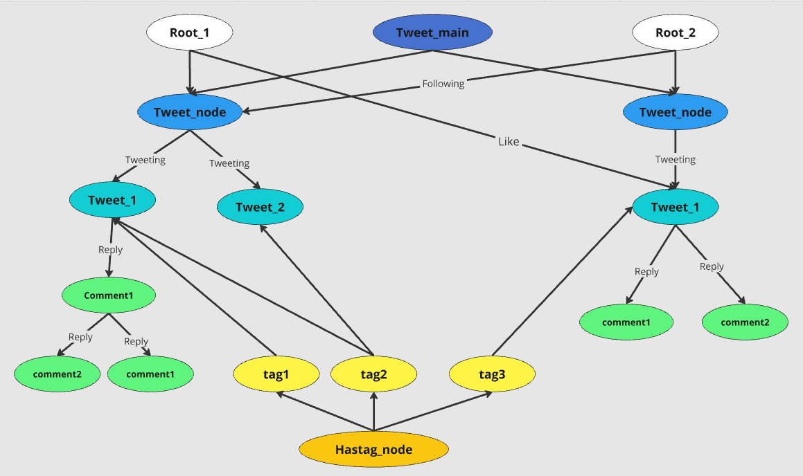

# littleX

littleX is a minimalistic social media platform prototype developed using the Jac programming language. It showcases fundamental social media functionalities, including user creation, following, tweeting, commenting, and reacting. Using Jaseci builtin user management system, users represented as roots. Using data spatial features in Jac, Tweets and comments are represented as nodes, while relationships like following, tweeting, and reacting are represented as edges, demonstrating a unique way to model social networks.

