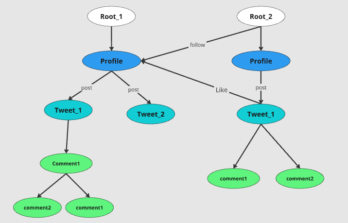

# LittleX: A Minimalistic Social Media Platform Prototype

LittleX is a lightweight social media application developed using the **Jaseci Stack**. It serves as a demonstration of how Jaseci Stack can be utilized to build scalable and intelligent applications.

## **About LittleX**

LittleX is a minimalistic implementation of a **social media platform** that showcases the capabilities of the Jaseci Stack. It includes features such as:

1. **User Profiles**:
   - Create and manage user accounts.
   - Follow other users and track relationships.

2. **Tweets**:
   - Post, view, and interact with tweets.

3. **Comments and Likes**:
   - Engage with tweets through comments and likes.

4. **AI-Powered Features**:
   - Utilizes **MTLLM** for GPT-4o summarization and SentenceTransformer for semantic search, enhancing user interactions.

5. **Cloud Deployment**:
   - Deploy workflows, walkers, and AI features to **Jac Cloud** for seamless scaling and execution.

6. **Microservice Integration**:
   - LittleX uses **Jac Cloud Orchestrator (jac-splice-orc)** to deploy Python modules as cloud-native microservices, enabling scalable AI integration and optimal performance.

## **LittleX Architecture**




## **Running LittleX on Local Environment**

### 1. Clone the Repository

Start by cloning the **LittleX** repository to your local system:

```bash
git clone https://github.com/Jaseci-Labs/littleX.git
cd littlex
```
### 2. Install Dependencies
```bash
pip install -r requirements.txt
```
### 3. Set OpenAI API Key

- For linux
   ```bash
   export OPENAI_API_KEY='your-open-api-key'
   ```
- For Windows
   ```bash
   set OPENAI_API_KEY='your-open-api-key'
   ```

### 4. Start the Backend Server
```bash
jac serve littleX_BE/littleX_full.jac
```
### 4. Run the Frontend Server
Open another command line
```bash
cd littleX_FE
npm i
npm run dev
```


